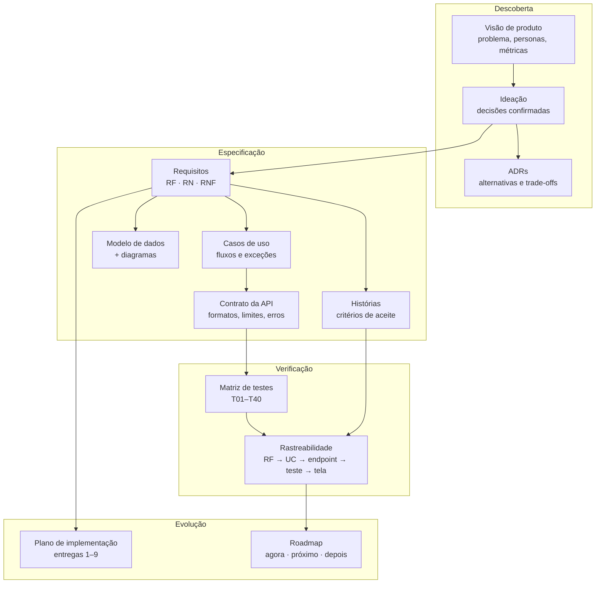

# Documentação do Merchant

A documentação acompanha o caminho de uma ideia até o software em produção: **problema → decisões → requisitos → especificação → verificação → entrega**. Cada artefato deriva do anterior e aponta para ele por IDs estáveis (RF, RN, UC, US, T, ADR).

## Por onde começar

| Seu objetivo | Leia | Tempo |
|---|---|---|
| Entender o produto e por que ele existe | [Visão de produto](visao-produto.md) | 5 min |
| Entender as escolhas e os trade-offs | [Registro de decisões](decisoes/README.md) | 10 min |
| Ver o que foi pedido, entregue e testado | [Matriz de rastreabilidade](rastreabilidade.md) | 5 min |
| Implementar ou testar uma funcionalidade | [Histórias](historias-usuario.md) → [Contrato da API](contrato-api.md) → [Matriz de testes](matriz-testes.md) | 20 min |
| Saber o que vem a seguir | [Roadmap](roadmap.md) | 3 min |

## Mapa dos artefatos

## Índice

### Produto

| Documento | Conteúdo |
|---|---|
| [visao-produto.md](visao-produto.md) | Problema, proto-personas, JTBD, proposta de valor, princípios, escopo, métricas, hipóteses e riscos |
| [ideacao.md](ideacao.md) | Registro histórico da ideação e das decisões confirmadas (14 a 18/08/2026) |
| [decisoes/](decisoes/README.md) | 11 ADRs de produto e arquitetura, com alternativas e consequências |
| [roadmap.md](roadmap.md) | Próximos passos priorizados por impacto e esforço, ligados a métricas e lacunas |
| [glossario.md](glossario.md) | Linguagem do domínio em português, API e banco |

### Requisitos e especificação

| Documento | Conteúdo |
|---|---|
| [requisitos.md](requisitos.md) | 18 requisitos funcionais, 34 regras de negócio, 7 não funcionais e o que ficou fora do escopo |
| [historias-usuario.md](historias-usuario.md) | 15 histórias em 5 épicos, MoSCoW, critérios de aceite em Gherkin e definição de pronto |
| [casos-de-uso.md](casos-de-uso.md) | UC01–UC16 com fluxos principal, alternativos e de exceção |
| [contrato-api.md](contrato-api.md) | Endpoints, formatos, normalização, paginação e erros |
| [modelo-banco.md](modelo-banco.md) | Tabelas, restrições e decisões de persistência |
| [diagramas.md](diagramas.md) | Contexto, casos de uso, ER, ciclos de vida do produto e da conta, sequência e deploy (Mermaid) |

### Qualidade e operação

| Documento | Conteúdo |
|---|---|
| [matriz-testes.md](matriz-testes.md) | T01–T40 ligados a requisitos e casos de uso |
| [rastreabilidade.md](rastreabilidade.md) | Cobertura ponta a ponta nos dois repositórios, incluindo lacunas |
| [plano-implementacao.md](plano-implementacao.md) | Sequência de entregas com critérios de conclusão |
| [deploy-render.md](deploy-render.md) | Implantação, segredos, CORS e saúde |

### Fontes UML (PlantUML)

[`uml-casos-de-uso.puml`](uml-casos-de-uso.puml) · [`uml-classes.puml`](uml-classes.puml) · [`diagrama-er.puml`](diagrama-er.puml). As versões renderizadas no GitHub estão em [diagramas.md](diagramas.md).

## Convenções

- **Português** na documentação e na interface. **Inglês** nos valores técnicos da API e no código. **Português** nos nomes de tabelas e colunas. O [glossário](glossario.md) faz a ponte.
- Documentos de decisão (ideação, ADRs) são **históricos**: registram o que se sabia na época. As regras vigentes estão em requisitos, contrato e testes.
- Toda mudança de comportamento atualiza, no mesmo PR: requisito, contrato, teste e rastreabilidade.
