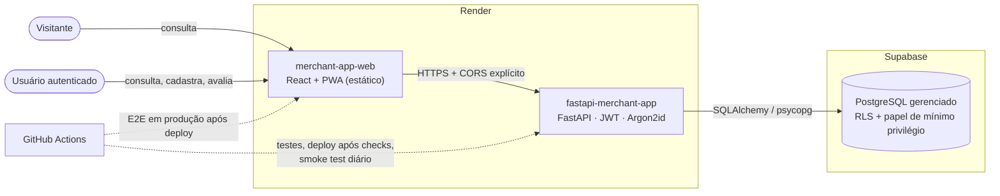
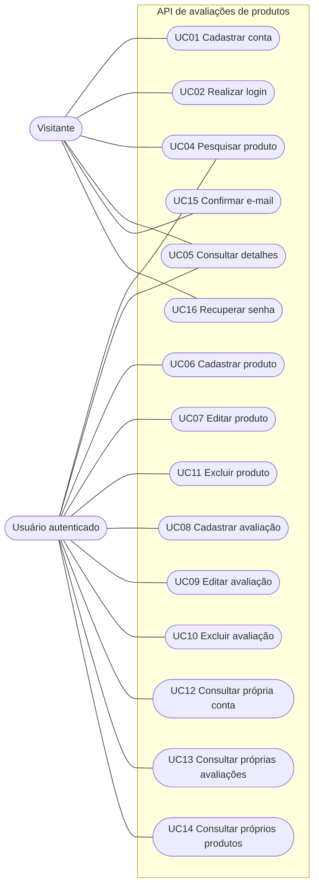
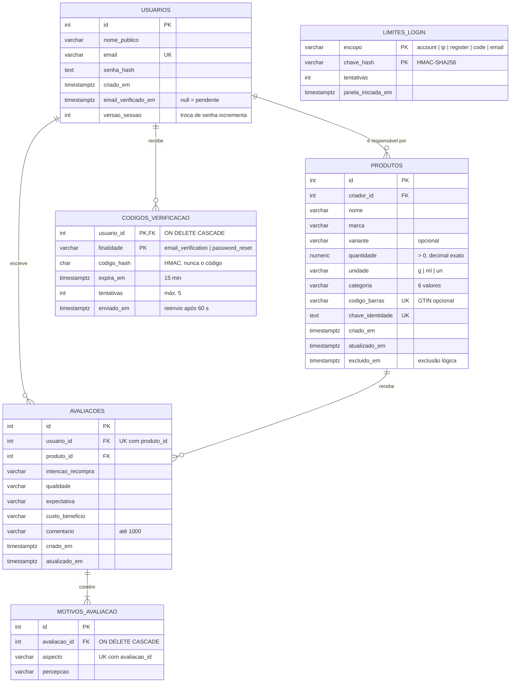
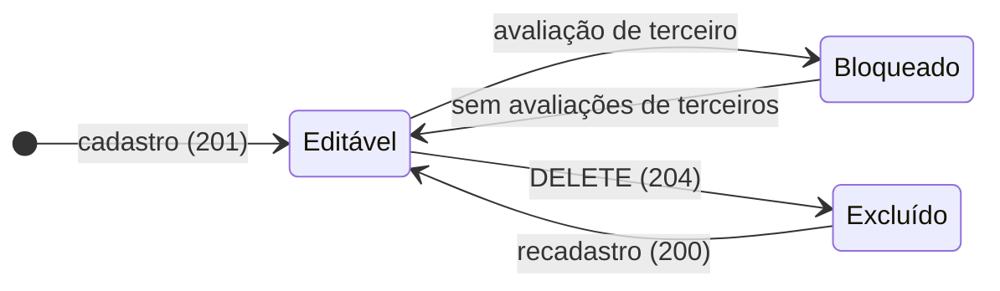
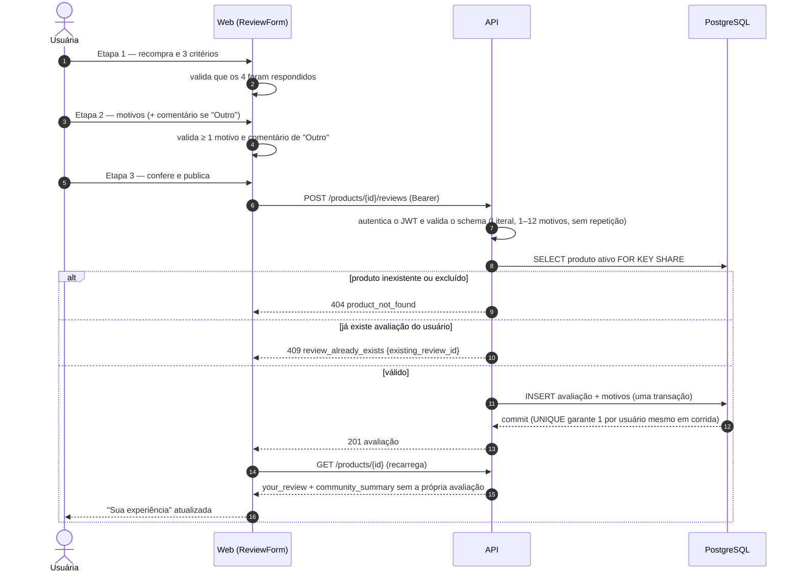
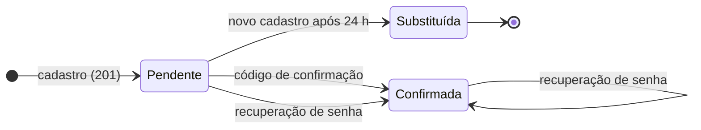
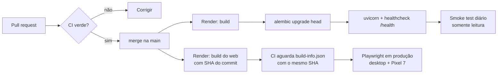

# Diagramas

Versões em Mermaid dos modelos do sistema, renderizadas diretamente pelo GitHub. As fontes PlantUML originais continuam em [`uml-casos-de-uso.puml`](uml-casos-de-uso.puml), [`uml-classes.puml`](uml-classes.puml) e [`diagrama-er.puml`](diagrama-er.puml).

## 1. Contexto do sistema

## 2. Casos de uso

## 3. Modelo de dados

`LIMITES_LOGIN` é uma tabela técnica, sem relação com as entidades de negócio: guarda só o HMAC do e-mail ou do IP.

## 4. Ciclo de vida do produto

Este diagrama resume [RN12, RN13](requisitos.md) e os ADRs [0005](decisoes/0005-bloqueio-de-edicao-apos-avaliacao.md) e [0008](decisoes/0008-exclusao-logica-e-reativacao.md) em um único lugar.

| Transição | Condição | Efeito |
|---|---|---|
| Editável → Editável | PATCH pelo responsável, ou o próprio responsável avalia | Dados corrigidos; o produto continua editável |
| Editável → Bloqueado | Primeira avaliação de **outro** usuário | PATCH → `409 product_locked_by_reviews` |
| Bloqueado → Editável | Todas as avaliações de terceiros foram excluídas | Edição volta a ser permitida |
| Editável → Excluído | DELETE pelo responsável, sem **nenhuma** avaliação | Some de busca, detalhe e listas; GTIN e chave de identidade continuam reservados |
| Excluído → Editável | Recadastro do mesmo item por qualquer usuário | Mesmo ID, novos dados, novo responsável |

Com qualquer avaliação, inclusive a do responsável, o DELETE retorna `409 product_has_reviews`.

## 5. Sequência — publicar uma avaliação

## 6. Ciclo de vida da conta

| Estado | Pode obter token? | Observações |
|---|---|---|
| Pendente | Não: login com senha correta → `403 email_not_verified` | E-mail reservado por 24 h; reenvio de código a cada 60 s |
| Confirmada | Sim | Recuperar a senha incrementa `versao_sessao` e derruba os tokens anteriores |
| Substituída | — | A conta pendente é apagada; como nunca obteve token, não tem dados |

Sem entrega de e-mail configurada (`EMAIL_DELIVERY=disabled`), o cadastro vai direto para **Confirmada**.

## 7. Deploy e verificação contínua

