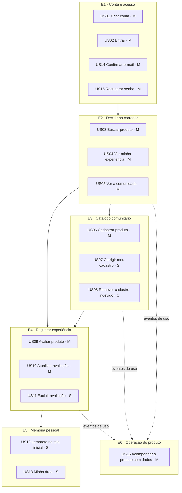

# Histórias de usuário e critérios de aceite

Os [requisitos](requisitos.md) dizem **o que o sistema deve fazer**. Este documento diz **para quem e por quê**, e define quando cada entrega está pronta. As histórias estão agrupadas em épicos que seguem a [jornada principal](visao-produto.md#5-jornada-principal). Os critérios de aceite estão em Gherkin, em português, e cada cenário corresponde a um comportamento verificado na [matriz de testes](matriz-testes.md).

**Priorização (MoSCoW) do MVP:** **M** = Must, **S** = Should, **C** = Could. Itens *Won't* estão na [visão de produto](visao-produto.md#fora-deliberadamente).

## Mapa de histórias



---

## E1 · Conta e acesso

### US01 — Criar conta · Must

> **Como** visitante, **quero** criar uma conta com nome público, e-mail e senha, **para** registrar minhas experiências e encontrá-las depois.

Rastreabilidade: RF01 · RN01–RN03 · UC01 · T01–T03

```gherkin
Cenário: cadastro válido
  Dado que o e-mail "ana@exemplo.com" não está cadastrado
  Quando eu me cadastro com nome "Ana", esse e-mail e uma senha de 15 caracteres
  Então a conta é criada
  E a resposta não contém a senha nem o hash

Cenário: e-mail equivalente já cadastrado
  Dado que "ana@exemplo.com" já possui conta
  Quando eu me cadastro com " ANA@Exemplo.com "
  Então recebo o erro "Este e-mail já está cadastrado."

Cenário: senha fraca
  Quando eu me cadastro com uma senha de 14 caracteres ou com "senhasenhasenha"
  Então o cadastro é recusado com erro de validação
  E a senha não é repetida na mensagem de erro

Cenário: nome público repetido
  Dado que outra pessoa usa o nome público "Ana"
  Quando eu me cadastro também como "Ana"
  Então a conta é criada normalmente
```

### US02 — Entrar na conta · Must

> **Como** pessoa cadastrada, **quero** entrar com e-mail e senha, **para** ver minha experiência pessoal nos produtos.

Rastreabilidade: RF02 · UC02 · T04–T06

```gherkin
Cenário: credenciais corretas
  Quando eu entro com e-mail e senha corretos
  Então recebo uma sessão válida por 24 horas
  E o painel de acesso fecha com minha sessão ativa

Cenário: credenciais incorretas não revelam qual campo falhou
  Quando eu entro com um e-mail inexistente ou com a senha errada
  Então vejo "E-mail ou senha inválidos."

Cenário: proteção contra tentativa e erro
  Dado que errei a senha 5 vezes nos últimos 15 minutos
  Quando tento entrar de novo
  Então vejo "Muitas tentativas de login. Tente novamente mais tarde."
```

### US14 — Confirmar meu e-mail · Must

> **Como** responsável pelo produto, **quero** que cada conta prove a posse de um e-mail real, **para** que bots não criem contas em massa e distorçam o catálogo e os indicadores. **Como** pessoa que se cadastra, **quero** confirmar com um código curto no próprio app, **para** começar a usar sem trocar de tela.

Rastreabilidade: RF16, RF17 · RN29–RN31, RN33 · UC15 · T34–T37, T39 · [ADR-0011](decisoes/0011-confirmacao-de-conta-por-codigo.md)

```gherkin
Cenário: cadastro leva à confirmação
  Quando eu me cadastro com dados válidos
  Então vejo "Enviamos um código de 6 dígitos para ana@exemplo.com"
  E ao digitar o código correto já entro na minha conta

Cenário: tentar entrar antes de confirmar
  Dado que me cadastrei e não confirmei o e-mail
  Quando entro com e-mail e senha corretos
  Então sou levada à tela de código em vez de entrar

Cenário: código errado ou vencido
  Quando digito um código errado ou com mais de 15 minutos
  Então vejo "Código inválido ou expirado."
  E depois de 5 erros preciso pedir um novo código

Cenário: reenviar código
  Quando peço "Reenviar código"
  Então o botão fica indisponível por 60 segundos
  E o código anterior deixa de valer

Cenário: cadastros em massa
  Dado que o mesmo endereço IP fez 10 cadastros na última hora
  Quando tenta o 11º
  Então recebe "Muitas solicitações deste endereço. Tente novamente mais tarde."
```

### US15 — Recuperar minha senha · Must

> **Como** pessoa que esqueceu a senha, **quero** criar uma nova com um código enviado ao meu e-mail, **para** não perder a memória de compras que já registrei.

Rastreabilidade: RF18 · RN29, RN31, RN32 · UC16 · T38 · [ADR-0011](decisoes/0011-confirmacao-de-conta-por-codigo.md)

```gherkin
Cenário: recuperação completa
  Quando escolho "Esqueci minha senha" e informo meu e-mail
  E digito o código recebido e uma nova senha de 15 caracteres
  Então entro na conta com a nova senha
  E sessões abertas em outros aparelhos são encerradas

Cenário: e-mail desconhecido não é revelado
  Quando peço recuperação para um e-mail sem conta
  Então vejo a mesma mensagem de "se existir uma conta, enviamos um código"

Cenário: serviço de e-mail indisponível
  Dado que o envio de e-mails não está configurado
  Quando peço recuperação
  Então vejo "O envio de e-mails está temporariamente indisponível."
```

---

## E2 · Decidir no corredor

### US03 — Buscar produto · Must

> **Como** compradora no mercado, **quero** encontrar um produto pelo nome, pela marca, pela categoria ou pelo código de barras, combinando os filtros quando precisar, **para** chegar rápido à informação que me ajuda a decidir.

Rastreabilidade: RF03, RF04 · RN14 · UC04 · T23–T25

```gherkin
Cenário: busca parcial sem acento e sem caixa
  Dado que existe o produto "Café Torrado" da marca "Pilão"
  Quando eu busco por nome "cafe"
  Então o produto aparece nos resultados

Cenário: busca exata por código de barras
  Quando eu busco pelo código "7891234567895"
  Então vejo somente o produto com esse GTIN

Cenário: busca sem resultados
  Quando eu busco por um termo inexistente
  Então vejo "Nenhum produto encontrado." e o atalho "Cadastrar produto"

Cenário: busca sem login
  Dado que não estou autenticada
  Quando eu busco um produto
  Então vejo os resultados e o resumo de recompra da comunidade

Cenário: filtros combinados
  Dado que existem "Café solúvel" (Alimentos) e "Café gelado" (Bebidas), ambos da marca "Nescafé"
  Quando eu busco por nome "cafe", marca "nescafe" e escolho a categoria Bebidas
  Então vejo somente "Café gelado"

Cenário: navegar só pela categoria
  Quando eu toco no filtro "Limpeza" sem digitar nada
  Então vejo todos os produtos de limpeza do catálogo

Cenário: a busca não se perde
  Dado que busquei por "cafe" em Bebidas e abri um resultado
  Quando volto à busca
  Então os filtros e os resultados continuam os mesmos
  E o endereço da página pode ser compartilhado com a mesma busca

Cenário: termo curto
  Quando eu busco pela marca "k"
  Então vejo "Digite pelo menos 2 letras para a marca." sem esperar a API
```

### US04 — Ver minha experiência em destaque · Must

> **Como** compradora recorrente, **quero** ver primeiro a minha própria avaliação do produto, **para** não repetir um erro nem esquecer um acerto.

Rastreabilidade: RF05 · RN26 · UC05 · T26 · [ADR-0006](decisoes/0006-avaliacao-pessoal-separada.md)

```gherkin
Cenário: produto que já avaliei
  Dado que avaliei o produto com "Não compraria novamente"
  Quando abro o produto na busca
  Então o card mostra "Não compraria" como minha intenção
  E o detalhe mostra "Sua experiência" separada da comunidade

Cenário: minha avaliação não entra nos indicadores que eu vejo
  Dado que o produto tem só a minha avaliação
  Quando abro o detalhe autenticada
  Então o resumo da comunidade informa 0 avaliações
```

### US05 — Ver o que a comunidade achou · Must

> **Como** explorador, **quero** ver a distribuição das opiniões e os comentários de outras pessoas, **para** decidir se vale testar um produto novo.

Rastreabilidade: RF11, RF12 · RN27 · UC05 · T26, T27, T29

```gherkin
Cenário: indicadores em percentuais
  Dado que 3 pessoas avaliaram o produto com recompra "sim", "sim" e "não"
  Quando abro o detalhe como visitante
  Então vejo "Compraria novamente?" com Sim 67% e Não 33%
  E vejo as distribuições de qualidade, expectativa e custo-benefício

Cenário: privacidade dos autores
  Quando vejo as avaliações da comunidade
  Então cada avaliação mostra apenas o nome público e a data do autor
```

---

## E3 · Catálogo comunitário

### US06 — Cadastrar produto que não existe · Must

> **Como** usuária autenticada, **quero** cadastrar um produto que não encontrei, **para** poder avaliá-lo e ajudar outras pessoas.

Rastreabilidade: RF06 · RN05–RN12 · UC06 · T08–T11, T16, T17 · [ADR-0004](decisoes/0004-catalogo-canonico-comunitario.md)

```gherkin
Cenário: cadastro com normalização de medida
  Quando cadastro "Detergente Neutro", marca "Limpol", 1,5 L, categoria Limpeza
  Então o produto é criado com quantidade 1500 e unidade "ml"
  E sou levada ao detalhe do produto

Cenário: duplicata escrita de outro jeito
  Dado que existe o produto "Café", marca "Pilão", 500 g
  Quando cadastro o produto "cafe", marca " PILAO ", 0,5 kg
  Então vejo "Este produto já está cadastrado."

Cenário: código de barras inválido
  Quando informo um GTIN com dígito verificador errado
  Então o cadastro é recusado com erro de validação

Cenário: recadastro de produto removido
  Dado que um produto sem avaliações foi excluído
  Quando cadastro o mesmo item novamente
  Então o registro original é reativado com o mesmo identificador
  E passo a ser a responsável por ele
```

### US07 — Corrigir meu cadastro · Should

> **Como** quem cadastrou um produto, **quero** corrigir um erro de digitação, **para** que o catálogo fique correto, **sem** alterar o que outras pessoas já avaliaram.

Rastreabilidade: RF07 · RN13 · UC07 · T12, T13 · [ADR-0005](decisoes/0005-bloqueio-de-edicao-apos-avaliacao.md)

```gherkin
Cenário: correção antes de avaliações de terceiros
  Dado que cadastrei o produto e apenas eu o avaliei
  Quando altero a variante
  Então a alteração é salva

Cenário: produto já avaliado por outra pessoa
  Dado que outra pessoa avaliou o produto
  Quando abro "Corrigir cadastro"
  Então vejo "Correção indisponível" antes de preencher qualquer campo

Cenário: outra pessoa avalia enquanto corrijo
  Dado que abri a correção de um produto sem avaliações de terceiros
  E outra pessoa o avaliou nesse meio-tempo
  Quando salvo a correção
  Então recebo "O produto não pode ser editado porque outra pessoa já o avaliou."

Cenário: correção que duplica outro produto
  Quando corrijo o nome para o de um produto que já existe
  Então vejo "Este produto já está cadastrado." e o atalho "Ver produto já cadastrado"

Cenário: nada alterado
  Quando salvo sem mudar nenhum campo
  Então vejo "Nada foi alterado." e nenhuma requisição é enviada
```

### US08 — Remover cadastro indevido · Could

> **Como** quem cadastrou um produto por engano, **quero** removê-lo, **para** não poluir o catálogo.

Rastreabilidade: RF13 · UC11 · T14, T15 · [ADR-0008](decisoes/0008-exclusao-logica-e-reativacao.md) · **Interface: pendente**

```gherkin
Cenário: produto sem avaliações
  Quando excluo um produto que cadastrei e que ninguém avaliou
  Então ele deixa de aparecer na busca e na minha área

Cenário: produto com avaliações
  Dado que o produto tem qualquer avaliação, inclusive a minha
  Quando tento excluí-lo
  Então recebo "O produto não pode ser excluído enquanto possuir avaliações."
```

---

## E4 · Registrar experiência

### US09 — Avaliar produto · Must

> **Como** usuária que acabou de usar um produto, **quero** registrar se compraria de novo e por quê, **para** lembrar disso na próxima compra.

Rastreabilidade: RF08 · RN15–RN24 · UC08 · T18–T20 · [ADR-0001](decisoes/0001-avaliacao-estruturada-sem-nota.md), [0002](decisoes/0002-intencao-de-recompra-como-resumo.md), [0003](decisoes/0003-motivos-estruturados-obrigatorios.md)

```gherkin
Cenário: avaliação completa em três etapas
  Dado que estou no detalhe de um produto que não avaliei
  Quando respondo recompra, qualidade, expectativa e custo-benefício
  E escolho "Embalagem" como negativa e "Sabor" como positivo
  E confiro o resumo e publico
  Então vejo minha avaliação em "Sua experiência"

Cenário: não avança sem os quatro critérios
  Quando tento continuar sem responder "Custo-benefício"
  Então vejo "Responda aos quatro critérios antes de continuar."

Cenário: motivo obrigatório
  Quando tento continuar sem escolher nenhum aspecto
  Então vejo "Selecione pelo menos um motivo."

Cenário: "Outro" exige explicação
  Quando escolho o aspecto "Outro" sem comentário
  Então vejo "Explique no comentário o motivo “Outro”."

Cenário: segunda avaliação do mesmo produto
  Dado que já avaliei o produto
  Quando tento criar outra avaliação
  Então recebo "Você já avaliou este produto."
```

### US10 — Atualizar avaliação · Must

> **Como** usuária que mudou de opinião, **quero** editar minha avaliação, **para** que a memória reflita minha experiência mais recente.

Rastreabilidade: RF09 · RN25, RN28 · UC09 · T21 · [ADR-0007](decisoes/0007-avaliacao-unica-sem-historico.md)

```gherkin
Cenário: edição substitui a versão anterior
  Dado que avaliei com recompra "sim"
  Quando edito para "talvez" e salvo
  Então "Sua experiência" mostra "Talvez"
  E não existe histórico da versão anterior

Cenário: estado final continua válido
  Dado que minha avaliação usa o aspecto "Outro" com comentário
  Quando removo o comentário
  Então a alteração é recusada
```

### US11 — Excluir avaliação · Should

> **Como** autora de uma avaliação, **quero** excluí-la com confirmação, **para** corrigir um registro feito por engano sem risco de apagar por acidente.

Rastreabilidade: RF10 · RN25 · UC10 · T22 · e2e "exclusão exige confirmação e atualiza o detalhe"

```gherkin
Cenário: exclusão confirmada
  Quando clico em "Excluir" e confirmo em "Excluir avaliação"
  Então minha avaliação some e posso avaliar o produto de novo

Cenário: cancelamento
  Quando clico em "Excluir" e depois em "Cancelar" ou pressiono Esc
  Então nada é excluído e o foco volta ao botão de origem
```

---

## E5 · Memória pessoal

### US12 — Lembrete na tela inicial · Should

> **Como** compradora recorrente, **quero** ver minhas avaliações mais recentes ao abrir o app, **para** refrescar a memória antes de sair para o mercado.

Rastreabilidade: RF14 · UC13 · T28

```gherkin
Cenário: usuária com avaliações
  Dado que avaliei produtos
  Quando abro a tela inicial autenticada
  Então vejo "Lembrete para você" com a avaliação mais recente
  E até duas outras em "Avaliações recentes"

Cenário: usuária sem avaliações
  Quando abro a tela inicial sem ter avaliado nada
  Então vejo "Suas experiências vão aparecer aqui." e o atalho para buscar
```

### US13 — Minha área · Should

> **Como** usuária, **quero** ver todos os produtos que cadastrei e todas as avaliações que fiz, **para** acompanhar minha contribuição e reencontrar itens.

Rastreabilidade: RF14 · UC12–UC14 · T28

```gherkin
Cenário: abas pessoais
  Quando abro "Minhas avaliações"
  Então vejo minhas avaliações da mais recente para a mais antiga
  E posso alternar para "Meus produtos" com as setas do teclado

Cenário: acesso sem login
  Dado que não estou autenticada
  Quando acesso /account
  Então vejo o convite para entrar, e não os dados de outra pessoa
```

## E6 · Operação do produto

### US16 — Acompanhar o produto com dados · Must

> **Como** responsável pelo produto, **quero** um painel com o estado geral do frontend e do backend, **para** decidir com dados, e não por impressão.

Rastreabilidade: RF19, RF20 · RN35–RN40 · UC17 · T41–T46 · [ADR-0012](decisoes/0012-painel-e-instrumentacao-propria.md)

```gherkin
Cenário: visão geral para administração
  Dado que meu e-mail está em ADMIN_EMAILS
  Quando abro /admin
  Então vejo a saúde da API e do banco, as versões no ar e o estado do e-mail
  E vejo a North Star e as métricas da visão de produto, cada uma com meta e estado
  E cada gráfico tem uma tabela equivalente

Cenário: período
  Quando escolho 7, 30 ou 90 dias
  Então todos os números e séries passam a considerar esse período

Cenário: quem não administra
  Dado que estou autenticada, mas meu e-mail não está em ADMIN_EMAILS
  Quando abro /admin
  Então vejo que o acesso é restrito, e a interface não consulta a API

Cenário: privacidade
  Quando uso o app com Do Not Track ativado
  Então nenhum evento de uso é enviado
```

---

## Definição de pronto (DoD)

Uma história só está pronta quando:

1. todos os cenários passam em testes automatizados: API (pytest) e, quando houver tela, interface (Vitest ou Playwright);
2. o contrato da API e a [matriz de rastreabilidade](rastreabilidade.md) estão atualizados;
3. erros aparecem para o usuário com mensagem em português, sem expor dados sensíveis;
4. a tela funciona em 320 px de largura e por teclado;
5. o CI está verde e o smoke test de produção passa depois do deploy.
