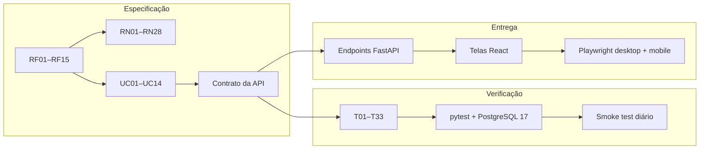

# Matriz de rastreabilidade

Este documento responde, para cada requisito: **onde está especificado, onde é garantido, como é testado e onde o usuário o encontra**. Ele liga os dois repositórios:

- **API:** este repositório (`fastapi-merchant-app`)
- **Web:** [`merchant-app-web`](https://github.com/vsys-val/merchant-app-web)

Legenda de cobertura na interface: ✅ disponível · ◐ parcial · — não se aplica · ⚠️ lacuna conhecida (ver [roadmap](roadmap.md))

## 1. Requisitos funcionais

| RF | Requisito | Caso de uso | Endpoint | Testes | Tela (web) | UI |
|---|---|---|---|---|---|---|
| RF01 | Cadastrar conta | UC01 | `POST /api/v1/users` | T01–T03 | Modal de acesso, aba "Cadastrar" | ✅ |
| RF02 | Autenticar e obter token | UC02 | `POST /api/v1/auth/login` | T04–T06 | Modal de acesso, aba "Entrar" | ✅ |
| RF03 | Consulta pública de produtos | UC04, UC05 | `GET /api/v1/products`, `GET /api/v1/products/{id}` | T07, T23 | `/search`, `/products/:id` | ✅ |
| RF04 | Pesquisar por nome, marca, categoria ou GTIN | UC04 | `GET /api/v1/products?name&brand&category&barcode` | T23–T25 | `/search`: seletor Produto · Marca · Código | ◐ ⚠️ sem filtro de categoria nem busca combinada |
| RF05 | Detalhe com avaliação própria separada | UC05 | `GET /api/v1/products/{id}` → `your_review` | T26 | `/products/:id`, seção "Sua experiência" | ✅ |
| RF06 | Cadastrar produto ausente | UC06 | `POST /api/v1/products` | T08–T11, T16, T17 | `/products/new` | ✅ |
| RF07 | Criador corrige produto sem avaliações de terceiros | UC07 | `PATCH /api/v1/products/{id}` | T12, T13 | — | ⚠️ sem tela |
| RF08 | Criar avaliação | UC08 | `POST /api/v1/products/{id}/reviews` | T18–T20 | Formulário em 3 etapas no detalhe | ✅ |
| RF09 | Editar a própria avaliação | UC09 | `PATCH /api/v1/reviews/{id}` | T21 | Botão "Editar" em "Sua experiência" | ✅ |
| RF10 | Excluir a própria avaliação | UC10 | `DELETE /api/v1/reviews/{id}` | T22 | Botão "Excluir" + diálogo de confirmação | ✅ |
| RF11 | Avaliações comunitárias | UC05 | `GET /api/v1/products/{id}/reviews` | T26, T29 | Seção "Avaliações da comunidade", paginada | ✅ |
| RF12 | Indicadores comunitários | UC05 | `community_summary` no detalhe e na busca | T26, T27 | "Resumo da comunidade" (4 distribuições) e card da busca | ✅ |
| RF13 | Exclusão lógica e reativação de produto | UC06, UC11 | `DELETE /api/v1/products/{id}`; `POST /api/v1/products` → `200` | T14–T16 | Reativação implícita no cadastro | ◐ ⚠️ sem botão de exclusão |
| RF14 | Conta, avaliações e produtos próprios | UC12–UC14 | `GET /api/v1/users/me`, `/users/me/reviews`, `/users/me/products` | T28 | `/account` (abas) e "Lembrete para você" em `/` | ✅ |
| RF15 | Verificação operacional | — | `GET /health` | T31 | Indicador "Catálogo conectado" em `/` | ✅ |

**Leitura rápida:** os 15 requisitos funcionais estão implementados e testados na API. Na interface, 12 estão completos, 2 parciais (RF04 e RF13) e 1 sem tela (RF07). As lacunas são escolhas de sequenciamento e estão priorizadas no [roadmap](roadmap.md).

## 2. Regras de negócio — onde cada uma é garantida

Uma regra crítica é garantida em **mais de uma camada**. A coluna "Banco" indica regras que continuam valendo mesmo sob concorrência ou se a aplicação tiver um bug.

| RN | Regra (resumo) | Schema / validação | Serviço | Banco | Testes |
|---|---|---|---|---|---|
| RN01 | ID interno único | — | — | `Identity` PK | T33 |
| RN02 | Nome público pode repetir | `UserCreate.name` | — | sem UNIQUE | T01 |
| RN03 | E-mail único e privado | `EmailStr`, casefold | `auth.create_user` | UNIQUE `email` | T02, T29 |
| RN04 | Leitura pública; escrita autenticada | — | `get_optional_user` / `get_current_user` | — | T07 |
| RN05–RN07 | Campos obrigatórios; categoria única | `ProductCreate` | — | NOT NULL, `ck_produtos_categoria` | T08 |
| RN08 | Seis categorias | `Category` Literal | — | `ck_produtos_categoria` | T08, T24 |
| RN09 | GTIN único e válido | `validate_gtin` (checksum) | `_matching_products` | UNIQUE `codigo_barras` | T10, T17 |
| RN10–RN12 | Registro canônico; deduplicação; conflito indica existente | `normalize_quantity`, `build_identity_key` | `create_product` (bloqueio `FOR UPDATE`) | UNIQUE `chave_identidade` | T09, T11, T16, T17 |
| RN13 | Edição bloqueada após avaliação de terceiro | — | `update_product` | — | T12, T13, T32 |
| RN14 | Nome/marca parcial; GTIN exato | parâmetros de query | `search_products` (filtra em memória) | — | T23 |
| RN15 | Uma avaliação por usuário e produto | — | `create_review` | UNIQUE `uq_avaliacoes_usuario_produto` | T18 |
| RN16–RN20 | Recompra e critérios obrigatórios e controlados | `Literal` em `ReviewCreate` | — | `ck_avaliacoes_*` | T19 |
| RN21–RN22 | ≥ 1 motivo; aspecto sem repetição | `validate_review_reasons` | `_validate_final_reasons` | UNIQUE `uq_motivos_avaliacao_aspecto`, `ck_motivos_*` | T19, T21 |
| RN23 | 12 aspectos | `Aspect` Literal | — | `ck_motivos_aspecto` | T19 |
| RN24 | "Outro" exige comentário | `validate_review_reasons` | valida o **estado final** no PATCH | — | T19, T21 |
| RN25 | Só o autor edita/exclui | — | `update_review`, `delete_review` | — | T22 |
| RN26 | Avaliação própria fora dos indicadores | — | `_split_reviews` | — | T26 |
| RN27 | Indicadores sob demanda | — | `_community_summary` | nada armazenado | T27 |
| RN28 | Sem histórico | — | substituição em `update_review` | — | T21 |

## 3. Requisitos não funcionais

| RNF | Requisito | Evidência | Testes |
|---|---|---|---|
| RNF01 | Hash de senha apropriado | Argon2id via `pwdlib` (`app/security.py`); política de 15–128 caracteres e lista de senhas comuns | T01, T03 |
| RNF02 | Sem dados sensíveis em respostas públicas | Schemas públicos separados das entidades; autor exposto só pelo nome | T29 |
| RNF03 | Documentação interativa OpenAPI | `/docs` com Bearer obrigatório/opcional por rota | `test_operations.py` |
| RNF04 | Instruções claras | [README](../README.md), [deploy](deploy-render.md) | revisão |
| RNF05 | Erros claros e códigos adequados | Envelope `{error:{code,message,details}}` em `app/errors.py` | T30 |
| RNF06 | Regras críticas com testes automatizados | 127 testes; CI com PostgreSQL 17; smoke test diário em produção | CI |

Além dos RNFs formais, a fase de endurecimento (Entrega 9) acrescentou: rate limiting persistido, RLS com papel de mínimo privilégio, CORS com origens explícitas e CSP estrita no frontend.

## 4. Fluxo de rastreabilidade

## 5. Como manter

- Novo requisito → ID novo em [requisitos](requisitos.md), linha nova aqui e pelo menos um ID de teste na [matriz](matriz-testes.md).
- Mudança de regra com alternativas relevantes → [ADR](decisoes/README.md) novo.
- Lacuna de interface → item no [roadmap](roadmap.md) com o RF correspondente.
