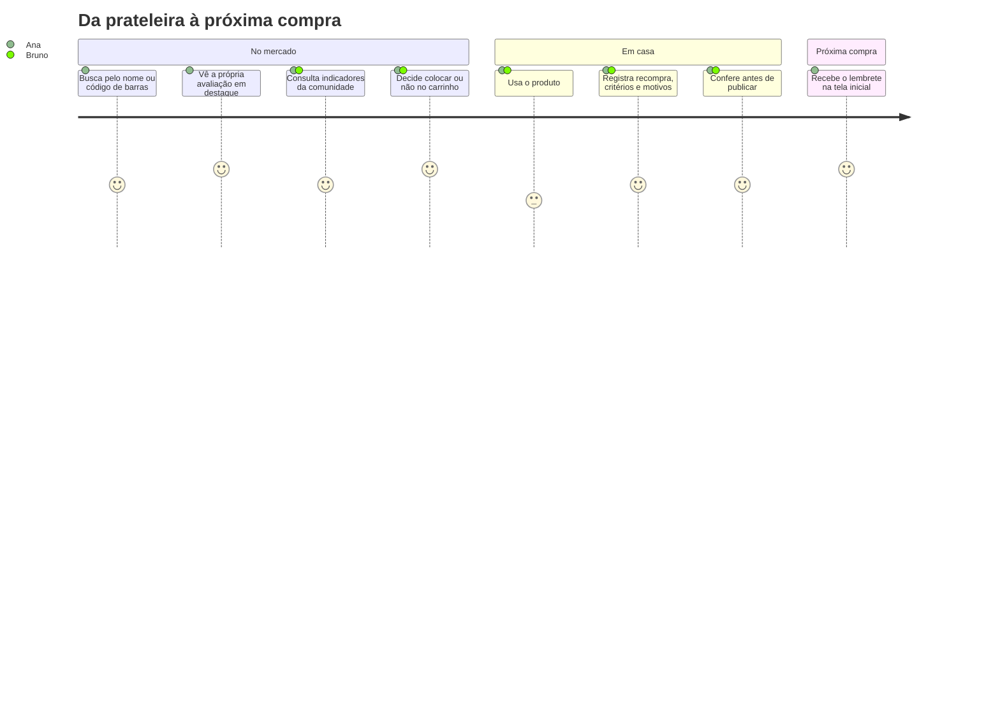
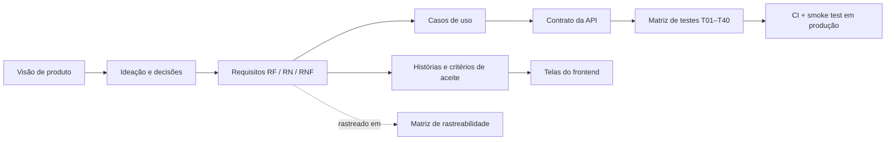

# Visão de produto — Merchant

> **Em uma frase:** o Merchant é a memória de compras de quem vai ao mercado. Ele responde, no corredor, à pergunta "eu compraria isto de novo?" com base na sua própria experiência e na da comunidade.

| | |
|---|---|
| **Estágio** | MVP publicado (API + web/PWA) |
| **Produto** | [merchant-app-web.onrender.com](https://merchant-app-web.onrender.com) |
| **API** | [fastapi-merchant-app.onrender.com/docs](https://fastapi-merchant-app.onrender.com/docs) |
| **Documentos derivados** | [Requisitos](requisitos.md) · [Histórias](historias-usuario.md) · [Decisões](decisoes/README.md) · [Roadmap](roadmap.md) |

## 1. Problema

Quem faz compras de mercado repete decisões dezenas de vezes por mês, entre centenas de itens parecidos. A experiência com cada item acontece **em casa, dias depois da compra**. A próxima decisão acontece **no corredor, sob pressa**. Entre esses dois momentos, a memória falha:

- a pessoa compra de novo o sabão que manchou a roupa ou o café que achou fraco;
- deixa de recomprar algo de que gostou porque não lembra a marca, a variante ou o tamanho;
- consulta avaliações genéricas (estrelas, notas de 0 a 10) que não dizem **por que** alguém gostou ou não.

A dor não é "falta de informação sobre produtos". É **falta de acesso, na hora da decisão, à experiência que a própria pessoa já teve**.

## 2. Para quem

As personas abaixo são **proto-personas**: hipóteses construídas na ideação, ainda não validadas com pesquisa. Elas orientam as decisões até existirem dados reais de uso (ver [§8](#8-hipóteses-e-riscos)).

### Persona primária — Ana, a compradora recorrente

- Faz a compra da casa toda semana, parte planejada e parte por impulso no corredor.
- Já comprou de novo algo de que não gostou por não lembrar a marca.
- Usa o celular dentro do mercado, com uma mão e pouco tempo.
- **Trabalho a realizar (JTBD):** *"Quando estou diante da prateleira, quero lembrar rapidamente como foi minha experiência com este produto, para não repetir um erro nem esquecer um acerto."*

### Persona secundária — Bruno, o explorador

- Gosta de testar marcas novas e produtos de limpeza e higiene diferentes.
- Quer saber se vale a pena trocar a marca habitual antes de gastar.
- **JTBD:** *"Quando considero um produto que nunca comprei, quero ver objetivamente o que outras pessoas acharam e por quê, para decidir se vale arriscar."*

### Anti-persona

Quem procura resenhas longas, notas de especialistas ou comparação de preços entre lojas. O Merchant não compete com sites de review nem com comparadores de preço.

## 3. Proposta de valor

| Para a Ana e o Bruno, que... | o Merchant... | diferente de... |
|---|---|---|
| esquecem experiências de compra | guarda uma avaliação pessoal por produto e a mostra em destaque | notas no celular ou listas soltas, sem estrutura nem busca por código de barras |
| desconfiam de notas genéricas | resume a experiência em **intenção de recompra** e mostra os **motivos** (aspecto + positivo/negativo) | apps de 1 a 5 estrelas, em que "3 estrelas" não diz nada acionável |
| compram de tudo no mercado | cobre alimentos, bebidas, limpeza, higiene e utilidades com um único modelo de avaliação | apps de nicho (só vinhos, só cosméticos) |

## 4. Princípios de produto

Estes princípios desempatam decisões. Cada um está rastreado até as decisões registradas.

1. **Decisão acima de opinião.** A pergunta central é "compraria de novo?", não "que nota você dá?" ([ADR-001](decisoes/0001-avaliacao-estruturada-sem-nota.md), [ADR-002](decisoes/0002-intencao-de-recompra-como-resumo.md))
2. **Todo julgamento tem um porquê.** Nenhuma avaliação existe sem ao menos um motivo estruturado ([ADR-003](decisoes/0003-motivos-estruturados-obrigatorios.md)).
3. **Minha experiência não é estatística.** A avaliação pessoal aparece separada e não contamina os indicadores da comunidade ([ADR-006](decisoes/0006-avaliacao-pessoal-separada.md)).
4. **Um produto, um registro.** O catálogo é comunitário e canônico, e as avaliações somam no mesmo item ([ADR-004](decisoes/0004-catalogo-canonico-comunitario.md)).
5. **Rápido no corredor, cuidadoso em casa.** A consulta é pública e imediata. A escrita pede login, confirmação e validação ([ADR-009](decisoes/0009-leitura-publica-escrita-autenticada.md)).

## 5. Jornada principal

Os dois contextos de uso, **durante a compra** (leitura, pressa, celular) e **depois do consumo** (escrita, calma), explicam boa parte do desenho: a busca por código de barras, a leitura sem login, o formulário em três etapas com conferência e a tela inicial com "Lembrete para você".

## 6. Escopo do MVP

### Dentro

| Capacidade | Por que está no MVP |
|---|---|
| Conta, login e sessão | Avaliação pessoal exige identidade |
| Busca por nome, marca, categoria ou GTIN | É o ponto de entrada no corredor |
| Cadastro comunitário de produtos com deduplicação | Sem catálogo pronto, a comunidade precisa poder cadastrar sem duplicar |
| Avaliação estruturada (recompra, 3 critérios, motivos) | É o núcleo da proposta de valor |
| Indicadores comunitários e avaliação pessoal separada | Atendem as duas personas sem misturar sinais |
| Área pessoal ("minha memória") | Fecha o ciclo de lembrar o que já foi avaliado |

### Fora, deliberadamente

| Item | Motivo |
|---|---|
| Nota geral manual | Contradiz o princípio 1 |
| Histórico de versões da avaliação | Só a opinião atual importa para a próxima compra ([ADR-007](decisoes/0007-avaliacao-unica-sem-historico.md)) |
| Critérios específicos por categoria | Complexidade alta antes de validar os critérios universais |
| Preços, lojas, promoções | Outro problema e outro produto |
| Imagens de produtos | Depende de fonte de imagens e de moderação |
| Moderação, mesclagem e administração de duplicatas | Mitigado pela deduplicação automática e pelo bloqueio de edição ([ADR-005](decisoes/0005-bloqueio-de-edicao-apos-avaliacao.md)) |
| Refresh token | Sessão de 24 h basta para o uso no mercado; recuperação de senha e confirmação de conta foram adicionadas depois do MVP ([ADR-0011](decisoes/0011-confirmacao-de-conta-por-codigo.md)) |

## 7. Métricas de sucesso

Todas as métricas abaixo são medidas pelo painel `/admin`, com eventos de uso próprios e sem ferramentas de terceiros ([ADR-0012](decisoes/0012-painel-e-instrumentacao-propria.md)). O painel mostra cada uma ao lado da meta. As metas são hipóteses iniciais, a calibrar com os primeiros dados.

| Tipo | Métrica | Por que importa | Meta inicial |
|---|---|---|---|
| **North Star** | Consultas a produtos que o usuário já avaliou, por usuário ativo por semana | Mede o valor central: a memória sendo usada na hora da decisão | ≥ 2 |
| Entrada | Avaliações publicadas por usuário ativo por mês | Sem escrita não há memória | ≥ 4 |
| Entrada | % de buscas com pelo menos um resultado | Mede a cobertura do catálogo comunitário | ≥ 70% |
| Entrada | % de usuários que publicam a 1ª avaliação na primeira semana | Ativação | ≥ 40% |
| Qualidade | % de avaliações com comentário além dos motivos obrigatórios | Riqueza do sinal para a comunidade | acompanhar |
| Guarda-corpo | Taxa de conflito `409 product_conflict` no cadastro | Mede se a deduplicação funciona sem frustrar o usuário | < 10% dos cadastros |
| Guarda-corpo | Abandono do formulário de avaliação entre as etapas 1 e 3 | Verifica se a estrutura não é pesada demais | < 30% |
| Guarda-corpo | Latência p95 da busca | O uso no corredor exige resposta rápida | < 800 ms |

## 8. Hipóteses e riscos

| # | Hipótese ou risco | Se estiver errada... | Como validar |
|---|---|---|---|
| H1 | Pessoas lembram de avaliar em casa, depois do consumo | O catálogo fica sem avaliações e a memória fica vazia | Taxa de ativação e avaliações por usuário; testar lembretes |
| H2 | "Compraria de novo?" é mais útil que uma nota | A proposta central perde força | Entrevistas e teste A/B de apresentação do resumo |
| H3 | Os 12 aspectos cobrem bem categorias muito diferentes | Uso excessivo de "outro" e motivos pouco úteis | % de avaliações com `other`; análise dos comentários |
| H4 | A deduplicação por GTIN + identidade normalizada evita duplicatas sem atrito | Catálogo poluído ou usuários bloqueados por conflito | Taxa de `409` e revisão amostral de duplicatas |
| R1 | Catálogo vazio no início (problema do "ovo e da galinha") | Buscas sem resultado afastam novos usuários | Seed por categoria; cadastro rápido a partir do GTIN |
| R2 | Avaliações falsas ou contas criadas em massa por bots | Indicadores comunitários perdem confiança | Uma avaliação por usuário e produto; confirmação de e-mail e limite de cadastros por IP ([ADR-0011](decisoes/0011-confirmacao-de-conta-por-codigo.md)); moderação no roadmap |
| R3 | ~~A busca filtrava em memória~~ | Latência crescia com o catálogo | Resolvido: busca no banco com índices de trigramas ([ADR-0013](decisoes/0013-busca-no-banco-com-trigramas.md)) |

## 9. Como este documento se conecta ao resto

A [matriz de rastreabilidade](rastreabilidade.md) mostra, para cada requisito, onde ele é especificado, implementado, testado e apresentado ao usuário.
